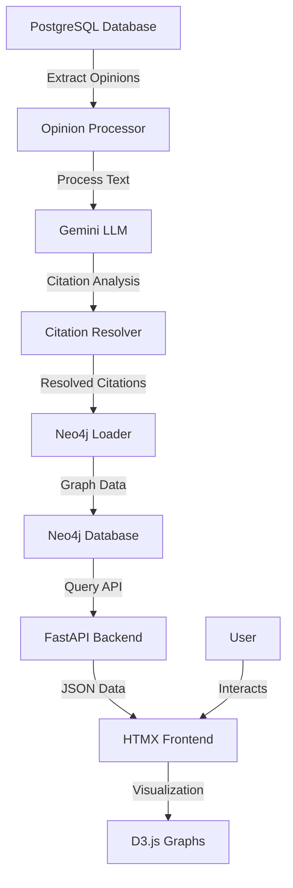
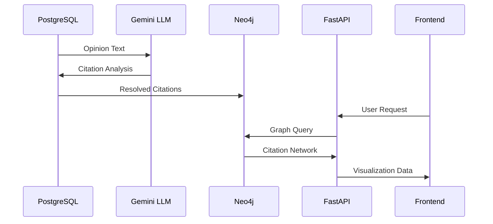

# OS Legal Explorer - Implementation Plan

## Project Overview

The OS Legal Explorer is a web application designed to visualize and explore legal citation networks. The project aims to:

1. Process court opinions from CourtListener's database
2. Extract citations and their metadata using LLMs (Gemini)
3. Build a graph database of citation relationships in Neo4j
4. Create an interactive web application to visualize and explore these relationships

## Current State Assessment

The project already has several key components implemented:

### Data Models
- Pydantic models for citation analysis (`src/llm_extraction/models.py`)
- SQLAlchemy models for database storage (`src/postgres/models.py`)
- Neo4j node/relationship models (`src/neo4j/models.py`)

### Data Processing
- LLM-based citation extraction using Gemini (`src/llm_extraction/rate_limited_gemini.py`)
- Citation resolution utilities (`src/postgres/db_utils.py`)
- Neo4j data loading utilities (`src/neo4j/neomodel_loader.py`, `src/neo4j/legacy_load_neo4j.py`)

### Infrastructure
- Docker setup for Neo4j (`docker-compose.yml`)
- Import scripts for Neo4j (`src/neo4j_import/`)

## Implementation Plan

### Phase 1: Complete the Data Pipeline

#### 1.1 Unified Pipeline Architecture
- Create a modular pipeline that connects:
  - PostgreSQL opinion data extraction
  - LLM-based citation analysis
  - Citation resolution
  - Neo4j graph database loading

#### 1.2 Pipeline Components
1. **Opinion Extractor**
   - Extract opinions from PostgreSQL in batches
   - Filter by court, date, or other criteria
   - Output: Dataframe of opinions with text and metadata

2. **Citation Analyzer**
   - Process opinions through Gemini LLM
   - Extract citations with treatment, relevance, and reasoning
   - Output: `CitationAnalysis` objects

3. **Citation Resolver**
   - Resolve citation strings to opinion cluster IDs
   - Link citations to their source opinions
   - Output: `CombinedResolvedCitationAnalysis` objects

4. **Graph Loader**
   - Load resolved citations into Neo4j
   - Create opinion nodes and citation relationships
   - Store metadata on relationships

#### 1.3 Pipeline Orchestration
- Create a unified CLI for running the pipeline
- Implement logging and error handling
- Add checkpointing for resumable processing
- Provide configuration options for each component

### Phase 2: Web Application Development

#### 2.1 Backend Architecture
- FastAPI application structure
- API endpoints for:
  - Opinion retrieval
  - Citation network queries
  - Graph visualization data

#### 2.2 Database Integration
- Neo4j query service for citation networks
- PostgreSQL service for opinion text and metadata
- Caching layer for performance optimization

#### 2.3 Frontend Development
- HTMX-based interactive UI
- D3.js visualizations:
  - Citation network graphs
  - Citation timeline views
  - Court/judge influence maps
- Tailwind CSS for styling

#### 2.4 Key Features
- Citation network exploration
- Opinion text viewer with highlighted citations
- Citation treatment analysis
- Court/judge influence visualization
- Search and filtering capabilities

### Phase 3: Deployment and Optimization

#### 3.1 Performance Optimization
- Query optimization for Neo4j
- Caching strategies
- Pagination and lazy loading

#### 3.2 Deployment Architecture
- Docker containerization
- Use Caddy
- Database backup and restore procedures

#### 3.3 Monitoring and Maintenance
- Logging and error tracking
- Performance monitoring
- Database maintenance scripts

## Technical Architecture

## Data Flow

## Implementation Timeline

## Next Steps

1. Finalize the pipeline architecture
2. Implement the missing components
3. Create a unified CLI for the pipeline
4. Begin backend development
5. Design the frontend interface

## Detailed Implementation Tasks

### Pipeline Integration Tasks

1. **Create Pipeline Using Python**
   - create an endpoint in the fastapi model only from requests from localhost (not public) that allows loading of a csv file e2e via local pathway.
      - this includes LLM Citation Extraction, using some of the methods in gemini_rate_limited.py
      - then resolving the cluster_id using db_utils (already done within pydantic model, but probably should refactor)
      - then adding these data to the neo4j database.
      - then adding to the postgres database. 
      - ideal worker friendly so we can do 15 RPM for google's limit.

5. **Optimize Neo4j Loading**
   - Batch processing for efficient graph updates
   - Transaction management for data consistency
   - Index optimization for query performance

### Web Application Tasks

1. **FastAPI Backend Setup**
   - Project structure and dependency management
   - No accounts or login, just a web page with a few tabs.
   - API documentation with Swagger/ReDoc

2. **Core API Endpoints**
   - `/api/opinions` - Opinion retrieval and search
   - `/api/citations` - Citation network queries
   - `/api/stats` - Network statistics and metrics

3. **Frontend Structure**
   - HTMX setup with Alpine.js for interactivity
   - Component-based architecture
   - Responsive design with Tailwind CSS

4. **Visualization Components**
   - Force-directed graph for citation networks
   - Timeline visualization for citation evolution
   - Heatmap for court/judge influence

5. **User Interface Features**
   - Search and filtering interface
   - Opinion text viewer with citation highlighting
   - Citation details panel
   - Network exploration controls

## Technical Challenges and Solutions

### Challenge 4: Interactive Visualization of Large Networks
- **Solution**: Implement progressive loading of graph data
- **Solution**: Use clustering and filtering to reduce visual complexity
- **Solution**: Optimize D3.js rendering with other tools if needed. 

## Future Enhancements

1. - Create dataset of each state's legal codes and import to postgres so we can  resolve the large majority of the rest of the citation types (assuming)

### LATER ENHANCEMENTS
1. **Advanced Analytics**
   - Citation influence scoring
   - Topic modeling of opinions
   - Prediction of future citations

2. **Integration with Other Legal Databases**
   - Westlaw/Lexis integration
   - International court databases
   - Legislative and regulatory databases

3. **Collaboration Features**
   - Annotation and commenting
   - Sharing of network views
   - Collaborative research tools

